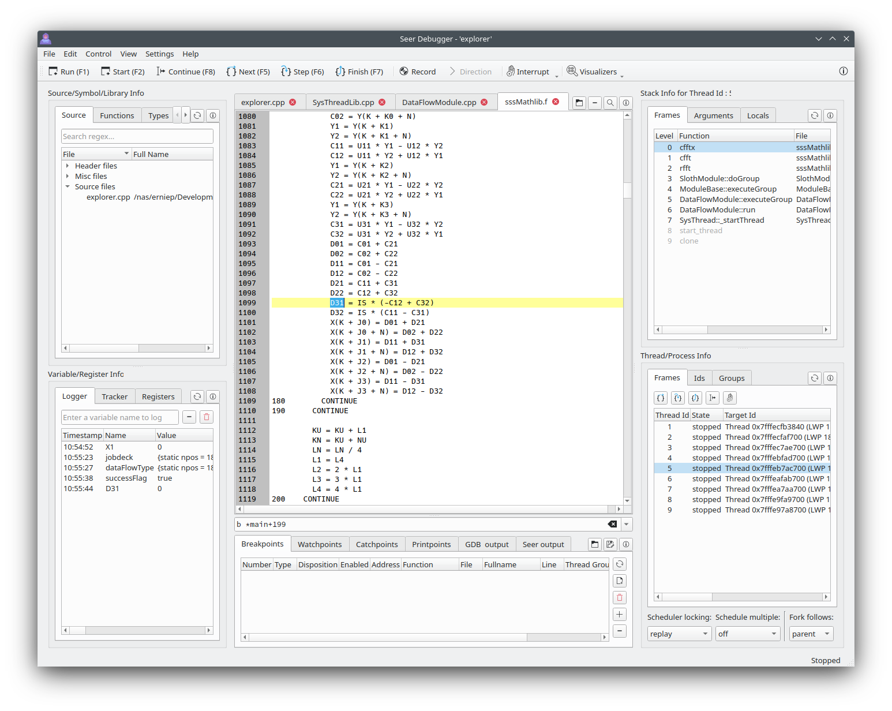
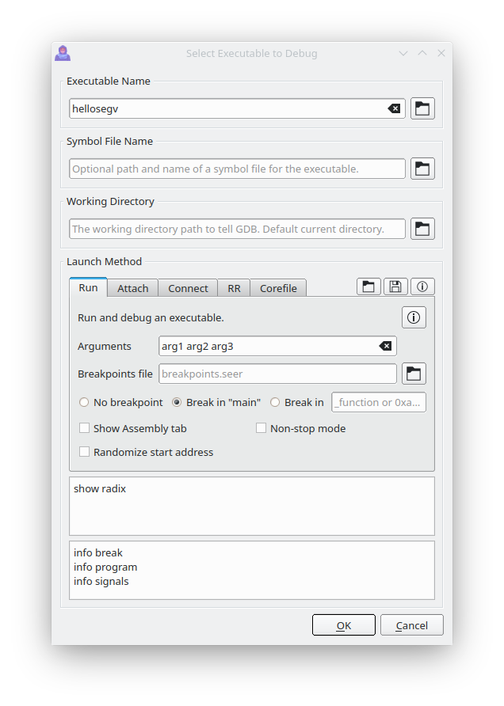
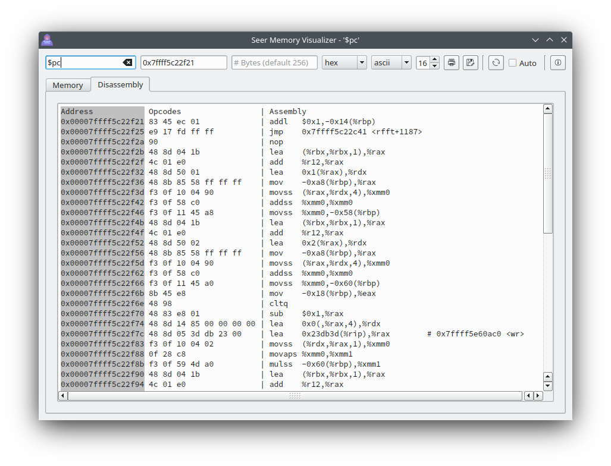
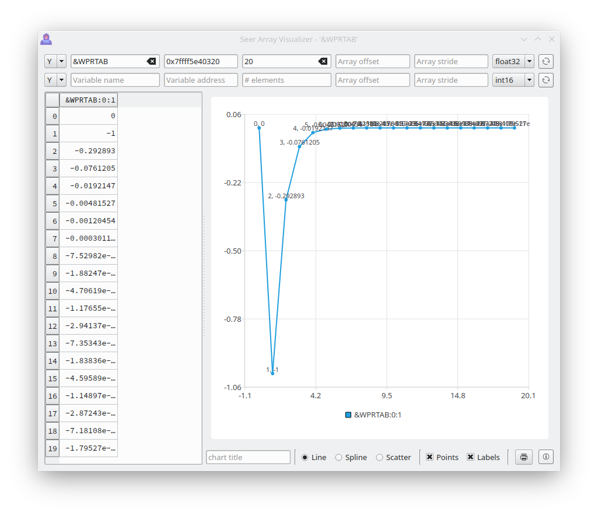
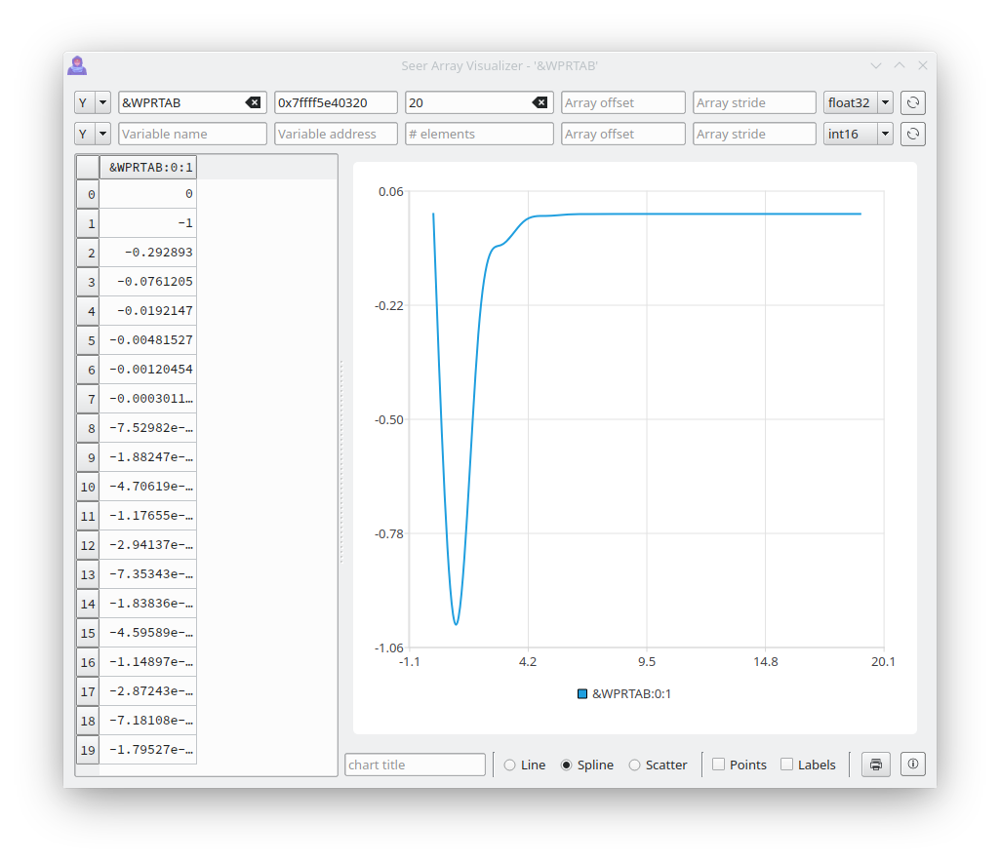
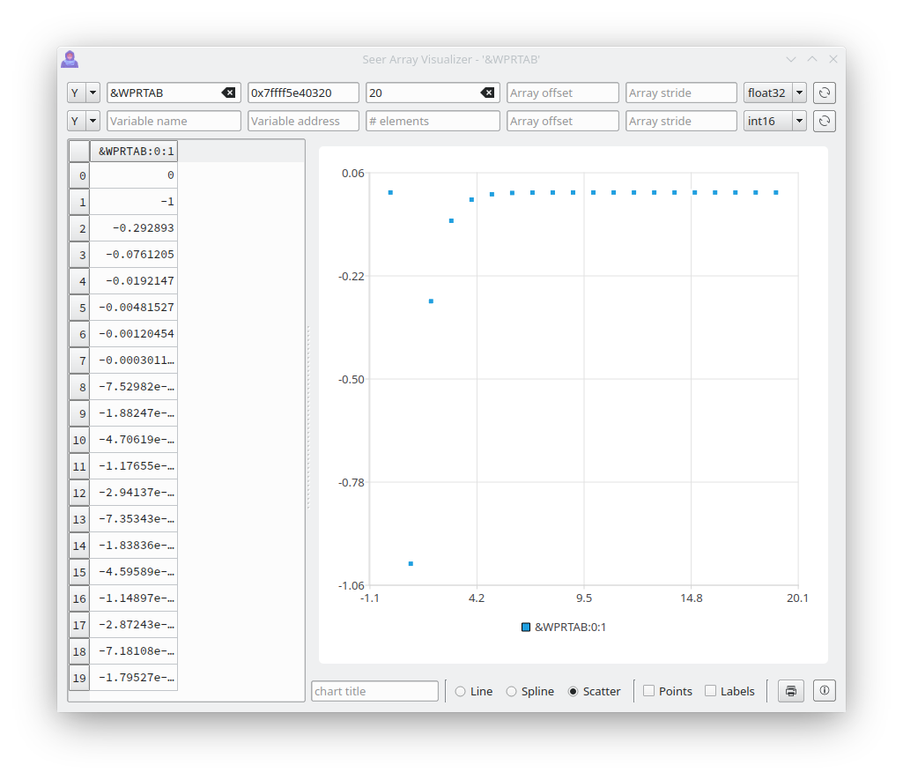
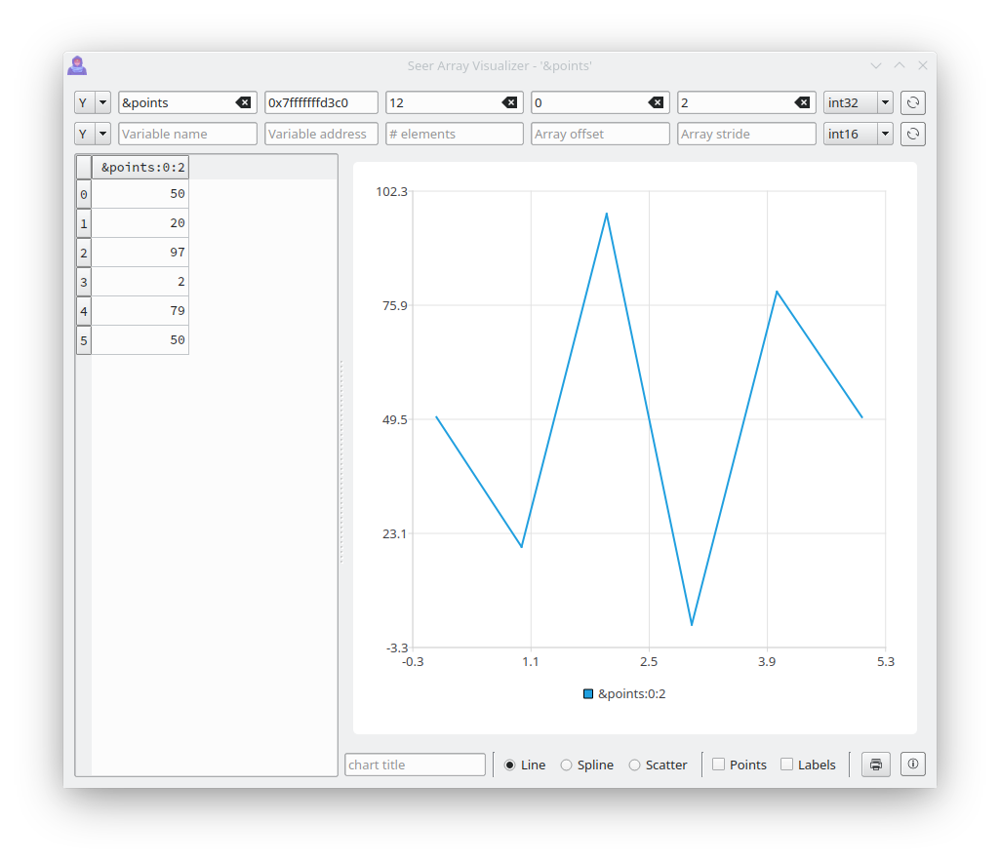
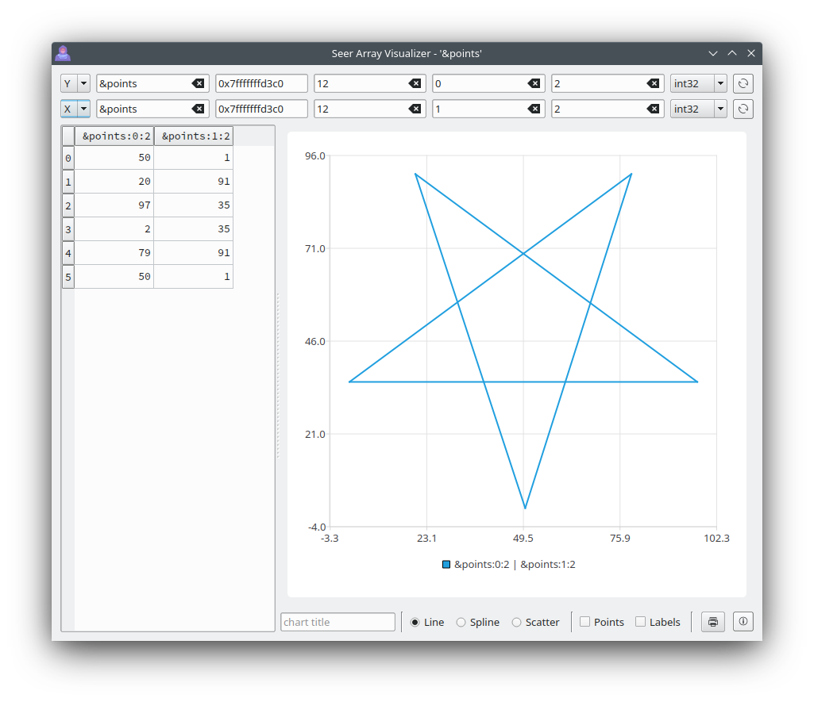

Introduction
============

Seer - a gui frontend to gdb for Linux.   (Ernie Pasveer  epasveer@att.net)

This project is actively worked on. The aim is a simple, yet pleasing gui to gdb.

Please report any bugs or desired features to my email or create a task in my
github project page.


Requirements
============

    * Linux
    * C++17
    * gdb with "mi" interpreter
    * QT5 (5.15.2 or newer)
    * QT5 QtCharts (5.15.2 or newer)
    * When building Seer from source, you will need the QT5 "devel" packages
      installed on your system for your distribution.


GUI overview
============

Examples of the various Seer views and dialogs.

Main View
---------

The main view for Seer looks like:


    * Source/Function/Types/Variables/Libraries
        * The list of source/header files that were used in the program.
        * Search for Functions, Types, and Static Variables.
          Dobule clicking will open the source file.
        * The list of shared libraries referenced by the program.
        * The list of source/header files can be searched in. This will "shrink" the list of files shown.
        * Double clicking on a file will open it in the Code Manager.

    * Variable/Register Info
        * Show variable and register values.
        * "Logger" - log the value of a variable. Manually enter it or double click on the variable in the file
          that is opened in the code manager.
        * "Tracker" - create a list of variables to show the value for whenever gdb reaches a stopping point.
          (step, next, finish, etc.) When the stopping point is reached, all variables in the list will show
          their potentially new value.
        * "Registers" - show the values of all cpu registgers.

    * Code Manager.
        * The large area of the middle part of the Seer gui.
        * Source files are opened in this view.
        * Text in a file can be seached for with ^F.
        * Variables can be added to the "Logger" by double clicking the variable name.
          Double click with CTLR key pressed will prepend variable with "*".
          Double click with SHIFT key pressed will prepend variable with "&".
          Double click with CTRL+SHIFT key pressed will prepend variable with "*&".
        * Variables can be added to the "Tracker" by selecting the varible name and RMB and select
          "Add variable to Tracker".
        * Variables can be added to the "Memory Visualizer" by selecting the varible name and RMB and select
          "Add variable to Memory Visualizer".
        * A breakpoint/printpoint can be created by RMB on a specific line.
        * Can execute to a specific line by RMB on a specific line.
        * Tabs in this view can be detached by double-clicking a tab.

    * Breakpoints, Watchpoints, Catchpoints, Printpoints, manual gdb commands, and logs.
        * The area below the Code Manager.
        * Manual commands.  Manually enter a gdb or gdbmi command.
          The commands are remembered for the next Seer use.
        * Breakpoint manager. Create and manage breakpoints.
        * Watchpoint manager. Create and manage watchpoints.
          A watchpoint monitors when a variable is accessed (read, write, read/write).
        * Catchpoint manager. Create and manage catchpoints.
          A catchpoint stops execution on a C++ throw/rethrow/catch call.
        * Printpoint manager. Create and manage printpoints.
          A printpoint is like a breakpoint but it allows you to print variables at
          that printpoint. See gdb's 'dprintf' call.
        * GDB output. A log of any output from the gdb program itself.
        * Seer output. A log of any output from the Seer program itself. As diagnostics.
        * Tabs in this view can be detached by double-clicking a tab.

    * Stack frame information.
        * Stack frame list. A frame can be double clicked to change the scope (the current function).
        * Stack frame arguments. For each frame, print the arguments passed to each function.
        * Stack locals. For the current function, print the values of the local variables.

    * Thread information.
        * Thread ids. A list of all threads. Double click on a thread id to change the scope (the current thread).
        * Thread frames. For each thread, list its stack frames.

Open Dialog
-----------

When the open exectable dialog is invoked, it looks like this :


Seer Console
------------

All text output from the executable will go to the Seer console.  Text input for the executable can be entered via the console too.


Memory Visualizer
-----------------

When looking at the contents of raw memory in the Memory Visualizer, it looks like this :

Memory | Disassembly
--- | ---
 | 

Array Visualizer
-----------------

When looking at the contents of arrays in the Array Visualizer, it looks like this :

Normal | Spline | Scatter
--- | --- | ---
 |  | 

Two arrays can be used as an X-Y plot. For example, this simple 'points' array forms the X-Y outline of a shape.
```
    int main() {
        int points[] = {50,1,20,91,97,35,2,35,79,91,50,1};
        return 0;
    }
```

X values | Y values | XY Values
--- | --- | ---
 |  | 


Starting Seer
=============

Seer is meant to easily start the program to debug from the command line. gdb has multiple
methods for debugging a program. So Seer natually does too.

    % seer --start myprog arg1 arg2             # Debug myprog with its arguments. Break in main().
    % seer --run   myprog arg1 arg2             # Debug myprog with its arguments. Run it immediately without breaking.
    % seer --attach <pid>  myprog               # Debug myprog by attaching to the currently running pid.
    % seer --connect <host:port> myprog         # Debug myprog by connecting to the currently started gdbserver process.
    % seer --core <corefile> myprog             # Debug a corefile for myprog.

    % seer                                      # Bring up a dialog box to set the program and debug method.
    % seer myprog arg1 arg2                     # Bring up a dialog box to set the debug method.

A breakpoint file can be read for --start and --run modes. This file contains previously saved
breakpoints (breakpoints, catchpoints, printpoints, etc.)

    % seer --run -b myprog.brk  myprog arg1 arg2   # Debug myprog with its arguments.
                                                   # Run it immediately and break at points describe in
                                                   # myprog.brk

Building Seer
=============

Download the latest code using 'clone'.

    % git clone https://github.com/epasveer/seer

Setup cmake and build

    % cd seer/src
    % mkdir build
    % cd build
    % cmake ..

    % make seer

Copy the seer binary to your bin directory of choice. One of the below. May need
root access.

    % cd seer/src/build
    % cp seer ~/bin/seer
    % cp seer /usr/local/bin/seer
    % cp seer /usr/bin/seer
    % rehash

Or use the 'install' make target. Which will usually copy it to /usr/local/bin.
May need root access.

    % cd seer/src/build
    % sudo make install
    
For Debian based releases, you can optionally use the 'seer_deb.sh' script to build and install Seer.

[Instructions for 'seer_deb.sh'](debian/README.md)
   

Support/Contact
===============

    Send an email to epasveer@att.net for any bugs or features. Or create a task
    in my github project page.

