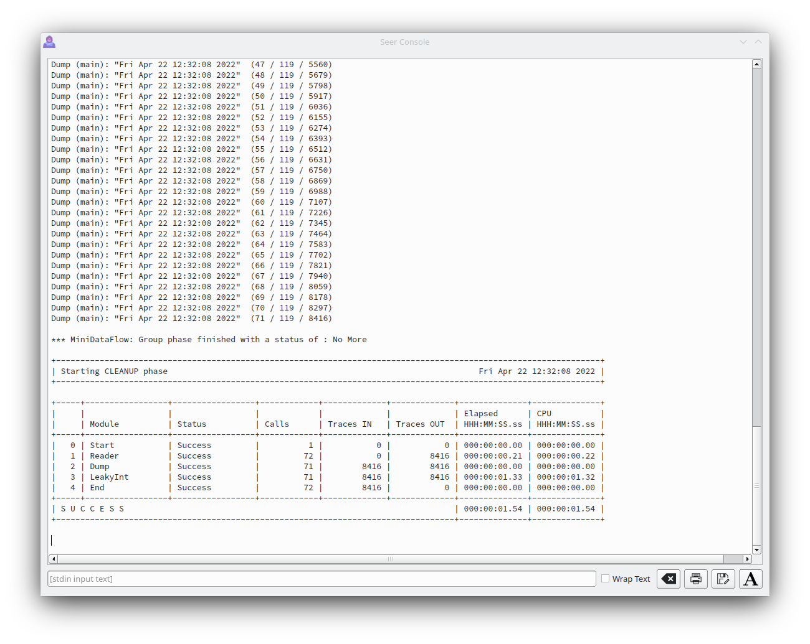

Introduction
============

Seer - a gui frontend to gdb for Linux.   (Ernie Pasveer  epasveer@att.net)

This project is actively worked on. The aim is a simple, yet pleasing gui to gdb.

This is the initial release. So it is considered beta. Please report any bugs or
desired features to my email.

Build
=====

Download the latest code using 'clone'.

    % git clone https://github.com/epasveer/seer

Setup cmake and build

    % cd seer
    % mkdir build
    % cd build
    % cmake ..

    % make seer

Copy the seer binary to your bin directory of choice. One of the below. May need
root access.

    % cp seer ~/bin/seer
    % cp seer /usr/local/bin/seer
    % cp seer /usr/bin/seer
    % rehash

Starting seer
=============

Seer is meant to easily start the program to debug from the command line. gdb has multiple
methods for debugging a program. So seer natually does too.

    % seer --start myprog arg1 arg2             # Debug myprog with its arguments. Break in main().
    % seer --run   myprog arg1 arg2             # Debug myprog with its arguments. Run it immediately without breaking.
    % seer --attach <pid>  myprog               # Debug myprog by attaching to the currently running pid.
    % seer --connect <host:port> myprog         # Debug myprog by connecting to the currently started gdbserver process.
    % seer --core <corefile> myprog             # Debug a corefile for myprog.

    % seer                                      # Bring up a dialog box to set the program and debug method.
    % seer myprog arg1 arg2                     # Bring up a dialog box to set the debug method.

GUI overview
============

    +-------------+----------------------------------------------------------------------------------------+-------------+
    |             |                                                                                        |             |
    |   AAA       |                                     CCC                                                |   DDD       |
    |             |                                                                                        |             |
    |             |                                                                                        |             |
    |             |                                                                                        |             |
    |             |                                                                                        |             |
    |             |                                                                                        |             |
    |             |                                                                                        |             |
    |             |                                                                                        |             |
    |             |                                                                                        |             |
    |             |                                                                                        |             |
    |             |                                                                                        |             |
    +-------------+                                                                                        +-------------+
    |             |                                                                                        |             |
    |   BBB       |                                                                                        |   EEE       |
    |             |                                                                                        |             |
    |             |                                                                                        |             |
    |             |                                                                                        |             |
    |             |                                                                                        |             |
    |             |                                                                                        |             |
    |             +----------------------------------------------------------------------------------------+             |
    |             |                                                                                        |             |
    |             |                                    FFF                                                 |             |
    |             |                                                                                        |             |
    |             |                                                                                        |             |
    +-------------+----------------------------------------------------------------------------------------+-------------+

    "AAA" - The list of source/header files that were used in the program.
            The list of shared libraries referenced by the program.
            The list of source/header files can be searched in. This will "shrink" the list of files shown.
            Double clicking on a file will open it in the code manager ("CCC").

    "BBB" - Show variable and register values.

            "Logs" - log the value of a variable. Manually enter it or double click on the variable in the file
            that is opened in the code manager ("CCC").

            "Watches" - create a list of variables to show the value for whenever gdb reaches a stopping point.
            (step, next, finish, etc.) When the stopping point is reached, all variables in the list will show
            their potentially new value.

            "Registers" - show the values of all cpu registgers.

    "CCC" - Code manager. Files are opened in this view. Text in a file can be seached for with ^F.

            Variables can be added to the "Logs" ("BBB") by double clicking the variable name.

            Variables can be added to the "Watch" ("BBB") by selecting the varible name and RMB and select
            "Add variable to Watches".

            Variables can be added to the "Memory Visualizer" by selecting the varible name and RMB and select
            "Add variable to Memory Visualizer".

            A breakpoint can be created by RMB on a specific line.

            Can execute to a specific line by RMB on a specific line.

    "FFF" - Manual commands.  Manually enter a gdb or gdbmi command.

            Breakpoint manager. Create and manage breakpoints.

            Watchpoint manager. Create and manage watchpoints. A watchpoint monitors when a variable is accessed
            (read, write, read/write).

            GDB output. A log of any output from the gdb program itself.

            Seer output. A log of any output from the seer program itself. As diagnostics.

    "DDD" - Stack frame information.

            Stack frame list. A frame can be double clicked to change the scope (the current function).

            Stack frame arguments. For each frame, print the arguments passed to each function.

            Stack locals. For the current function, print the values of the local variables.

    "EEE"   Thread information.

            Thread ids. A list of all threads. Double click on a thread id to change the scope (the current thread).

            Thread frames. For each thread, list its stack frames.

Open Dialog
===========

When the open exectable dialog is invoked, it looks like this :

Seer Console
============

All text output from the executable will go to the Seer console.  Text input for the executable can be entered via the console too.

Support/Contact
===============

    Send an email to epasveer@att.net for any bugs or features.

