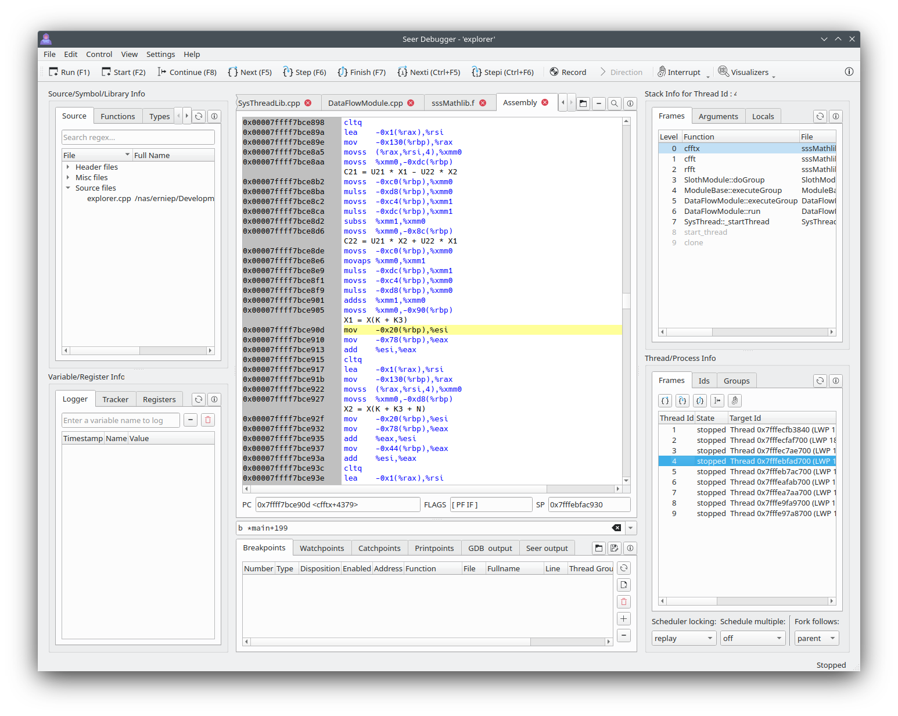
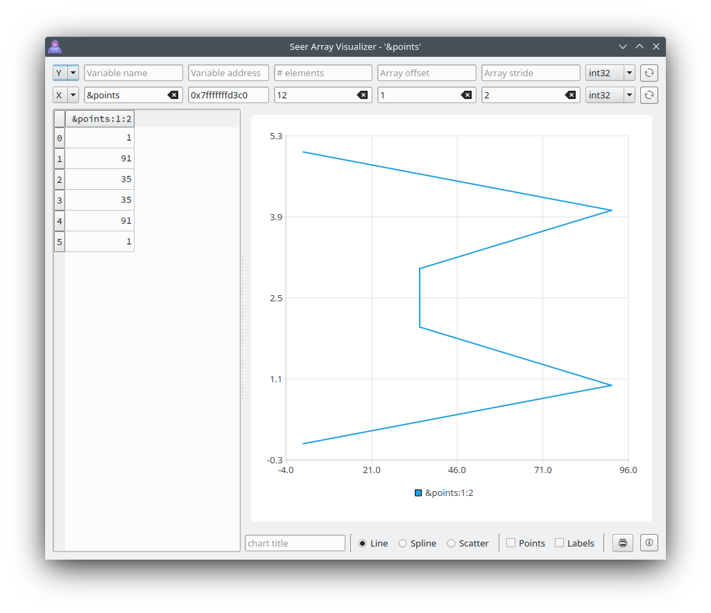
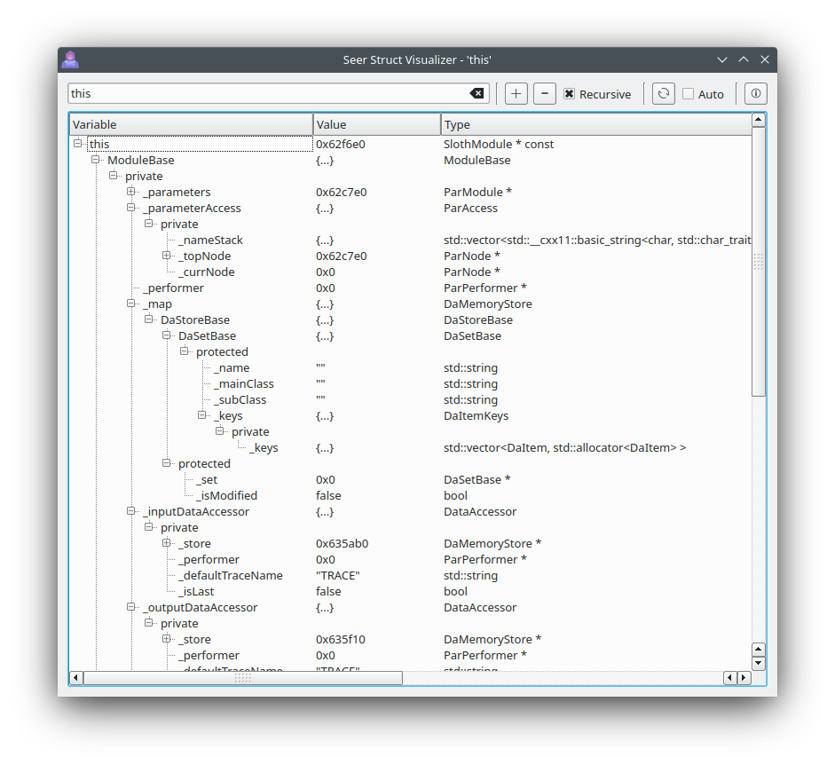
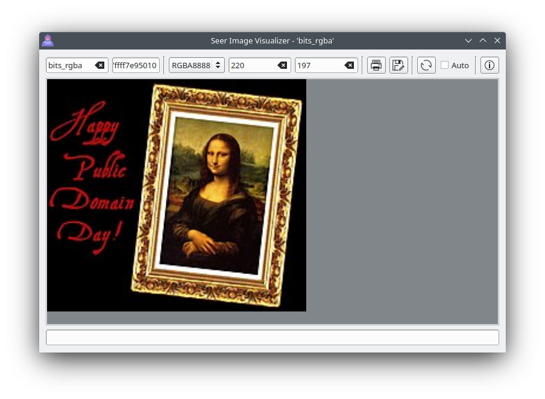

Introduction
============

Seer - a gui frontend to gdb for Linux.   (Ernie Pasveer  epasveer@att.net)

This project is actively worked on. The aim is a simple, yet pleasing gui to gdb.

Please report any bugs or desired features to my email or create a task in my
GitHub project page.


Requirements
============

* Linux
* C++17
* gdb with "mi" interpreter
* CMake (3.10 or newer)
* QT5 (5.15.2 or newer)
* QT5 QtCharts (5.15.2 or newer)
* QT as old as 5.9.5 (e.g., Ubuntu 18.04 LTS) is supported but has certain limitations.
* When building Seer from source, you will need the QT5 "devel" packages
  installed on your system for your distribution.

NOTE
====

As of the v1.9 release, **the Seer binary is now named 'seergdb'**. Previously it was named 'seer'. This is to remove a possibly
confusion with an existing project with the same name. And, hopefully, will allow easier packaging of Seer into distributions.


GUI overview
============

Examples of the various Seer views and dialogs.

Main View
---------

The main view for Seer looks like this:


* Source/Function/Types/Variables/Libraries
    * The list of source/header files that were used in the program.
    * Search for Functions, Types, and Static Variables.
      Dobule clicking will open the source file.
    * The list of shared libraries referenced by the program.
    * The list of source/header files can be searched. This will "shrink" the list of files shown.
    * Double clicking on a file will open it in the Code Manager.

* Variable/Register Info
    * Show variable and register values.
    * "Logger" - log the value of a variable. Manually enter it or double click on the variable in the file
      that is opened in the code manager.
    * "Tracker" - create a list of variables to show the value for whenever gdb reaches a stopping point
      (step, next, finish, etc.). When the stopping point is reached, all variables in the list will show
      their potentially new value.
    * "Registers" - show the values of all cpu registers.

* Code Manager.
    * The large area of the middle part of the Seer gui.
    * Source files are opened in this view.
    * Text in a file can be seached for with ^F.
    * Variables can be added to the "Logger" by double clicking the variable name.
      Double click with CTLR key pressed will prepend variable with "*".
      Double click with SHIFT key pressed will prepend variable with "&".
      Double click with CTRL+SHIFT key pressed will prepend variable with "*&".
    * Variables can be added to the "Tracker" by selecting the variable name and RMB and select
      "Add variable to Tracker".
    * Variables can be added to the "Memory Visualizer" by selecting the variable name and RMB and select
      "Add variable to Memory Visualizer".
    * A breakpoint/printpoint can be created by RMB on a specific line.
    * Can execute to a specific line by RMB on a specific line.
    * Tabs in this view can be detached by double-clicking a tab.

* Breakpoints, Watchpoints, Catchpoints, Printpoints, manual gdb commands, and logs.
    * The area below the Code Manager.
    * Manual commands.  Manually enter a gdb or gdbmi command.
      The commands are remembered for the next Seer use.
    * Breakpoint manager. Create and manage breakpoints.
    * Watchpoint manager. Create and manage watchpoints.
      A watchpoint monitors when a variable is accessed (read, write, read/write).
    * Catchpoint manager. Create and manage catchpoints.
      A catchpoint stops execution on a C++ throw/rethrow/catch call.
    * Printpoint manager. Create and manage printpoints.
      A printpoint is like a breakpoint but it allows you to print variables at
      that printpoint. See gdb's 'dprintf' call.
    * GDB output. A log of any output from the gdb program itself.
    * Seer output. A log of any output from the Seer program itself. As diagnostics.
    * Tabs in this view can be detached by double-clicking a tab.

* Stack frame information.
    * Stack frame list. A frame can be double clicked to change the scope (the current function).
    * Stack frame arguments. For each frame, print the arguments passed to each function.
    * Stack locals. For the current function, print the values of the local variables.

* Thread information.
    * Thread ids. A list of all threads. Double click on a thread id to change the scope (the current thread).
    * Thread frames. For each thread, list its stack frames.

* Supports Gdb's Reverse Debugging mode.
    * Turn instruction recording on or off.
    * Set playback direction to forward or reverse.

Open Dialog
-----------

When the open executable dialog is invoked, it looks like this:


Seer Console
------------

All text output from the executable will go to the Seer console. Text input for the executable can be entered via the console too.


Assembly View
-------------

Normally Seer will just show the source code as tabs in the Code Manager. The program's assembly can also be show as a tab.

Select "View->Assembly View" and an extra tab will be shown alongside the source code tabs that shows the current assembly being executed. Here is an example.


Like the source code tabs, breakpoints can be set in the assembly tab. The current instruction is highlighted.

Double-clicking on entries in the "Breakpoints" tab and the "Stack frames" tab will show the assembly for those addresses.

There are "Nexti" and "Stepi" hot-keys, as defined by your config settings. Normally "Ctrl+F5" and "CTRL+F6".
Using "^F" in the assembly tab will show a powerful search bar.

**The assembly feature in Seer is new. Feel free to suggest changes/features.**


Memory Visualizer
-----------------

When looking at the contents of raw memory in the Memory Visualizer, it looks like this :

Memory | Disassembly
--- | ---
 | 

Array Visualizer
-----------------

When looking at the contents of arrays in the Array Visualizer, it looks like this :

Normal | Spline | Scatter
--- | --- | ---
 |  | 

Two arrays can be used as an X-Y plot. For example, this simple 'points' array forms the X-Y outline of a shape.
```
    int main() {
        int points[] = {50,1,20,91,97,35,2,35,79,91,50,1};
        return 0;
    }
```

X values | Y values | XY Values
--- | --- | ---
 |  | 

Struct Visualizer
-----------------

When looking at the contents of a C/C++ struct or a C++ class in the Struct Visualizer, it looks like this.
This example shows the contents of "*this" for the current C++ class that Seer is in. All structure members
that are basic types can be edited.



There is also a **Basic Struct Visualizer** that is more light weight, but can not follow pointers and can not
be edited.

Image Visualizer
-----------------

When looking at the contents of raw memory that is an image, the Image Visualizer can be used.



Starting Seer
=============

Seer is meant to easily start the program to debug from the command line. gdb has multiple
methods for debugging a program. So Seer naturally does too.

    % seergdb --start myprog arg1 arg2                  # Debug myprog with its arguments. Break in main().
    % seergdb --run   myprog arg1 arg2                  # Debug myprog with its arguments. Run it immediately without breaking.
    % seergdb --attach <pid>  myprog                    # Debug myprog by attaching to the currently running pid.
    % seergdb --connect <host:port> myprog              # Debug myprog by connecting to the currently started gdbserver process.
    % seergdb --core <corefile> myprog                  # Debug a corefile for myprog.

    % seergdb --project myproject.seer                  # Load a debug session from a project file.
                                                        # Define and save a project in the Debug dialog.

    % seergdb                                           # Bring up a Debug dialog to set the program and debug method.
    % seergdb myprog arg1 arg2                          # Bring up a Debug dialog to set the debug method.

    % seergdb --config                                  # Bring up Seer config dialog.
                                                        # Save settings with 'Settings->Save Configuration'.

A breakpoint file can be read for --start and --run modes. This file contains previously saved
breakpoints (breakpoints, catchpoints, printpoints, etc.)

    % seergdb --run --bl myprog.brk  myprog arg1 arg2   # Debug myprog with its arguments.
                                                        # Run it immediately and break at points describe in
                                                        # myprog.brk

A breakpoint function can be set for --start and --run modes. The function can be a function name or
an address (eg: _start or 0xadad23220)

    % seergdb --run --bf _start myprog arg1 arg2        # Debug myprog with its arguments.
                                                        # Run it immediately and break in the function '_start'.

The Assembly Tab can be shown for --start and --run modes.

    % seergdb --start --sat yes myprog arg1 arg2        # Debug myprog with its arguments.
                                                        # Break in "main" and show the Assemby Tab.

The program's starting address can be randomizes for --start and --run modes. Normally gdb runs the program
with no start address randomization.

    % seergdb --start --sar yes  myprog arg1 arg2       # Debug myprog with its arguments.
                                                        # The program's start address is randomized.

The program's symbols can be taken from a separated file instead of the executable.

    % seergdb --sym myprog.db myprog arg1 arg2          # Debug myprog with its arguments.
                                                        # Take the symbols from myprog.dbg.

See "-h" for the full Seer help.

    % seergdb -h

**Some of the command line options can be permamently set in the Seer configuration.**

    % seergdb --config                                  # Bring up Seer config dialog.
                                                        # Save settings with 'Settings->Save Configuration'.

Building Seer
=============

Download the latest code using 'clone'.

    % git clone https://github.com/epasveer/seer

Setup cmake and build

    % cd seer/src
    % mkdir build
    % cd build
    % cmake ..

    % make seergdb

Copy the Seer binary to your bin directory of choice. One of the below. May need
root access.

    % cd seer/src/build
    % cp seergdb ~/bin/seergdb
    % cp seergdb /usr/local/bin/seergdb
    % cp seergdb /usr/bin/seergdb
    % rehash

Or use the 'install' make target, which will usually copy it to /usr/local/bin.
May need root access.

    % cd seer/src/build
    % sudo make install

For Debian based releases, you can use the normal tooling to build a .deb
package containing Seer. You need the `build-essential` package installed.

    % cd seer
    % dpkg-buildpackage


Support/Contact
===============

Send an email to epasveer@att.net for any bugs or features. Or create a task
in my GitHub project page.

